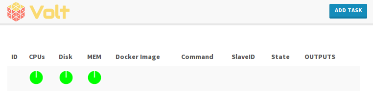

# 

*volt* is a simple Mesos framework written in Go.

## Installation

The following steps describe how to get started with the Volt framework.

### From Source

First get the go dependencies:

```sh
go get github.com/VoltFramework/volt/...
```

Then you can compile `volt` with:

```sh
go install github.com/VoltFramework/volt
```

If `$GOPATH/bin` is in your `PATH`, you can invoke `volt` from the CLI.

### Latest Release

To get started with the latest release, run the following commands on a mesos
master node:

```
wget https://github.com/voltframework/volt/releases/download/v1.0.0-alpha/volt
chmod +x volt
./volt --master=localhost:5050
```

### Getting started in a minute with Fig

Just run `fig up`, it will create three containers:

- a Mesos master, storing its data on the local filesystem
  (i.e. not in Zookeeper)
- a Mesos slave, cascaded to the master, and configured to use the Docker
  containerizer, with appropriate bind-mounts to use your Docker host to
  execute Mesos workloads
- the Volt framework itself, connected to the master, and exposing a web UI

Once everything is up, just point your browser to http://localhost:8080/
(or to your Docker host or VM if you're not running Docker natively on your
local machine) and you should see the web UI:



### API Requests

#### Run a container with data volumes
```json
{
    "cmd": "touch /data/volt",
    "cpus": "0.1",
    "mem": "32",
    "docker_image": "busybox",
    "volumes": [
        {
            "container_path":"/data",
            "host_path":"/volumes/volt"
        }
    ]
}
```

## Creators

**Victor Vieux**

- <http://twitter.com/vieux>
- <http://github.com/vieux>

**Isabel Jimenez**

- <http://twitter.com/ijimene>
- <http://github.com/jimenez>

## Thanks

Thanks to [@dhammon](http://github.com/dhammon) for his work on [gozer](http://github.com/twitter/gozer)

## Licensing

Volt is licensed under the Apache License, Version 2.0. See LICENSE for full license text.

